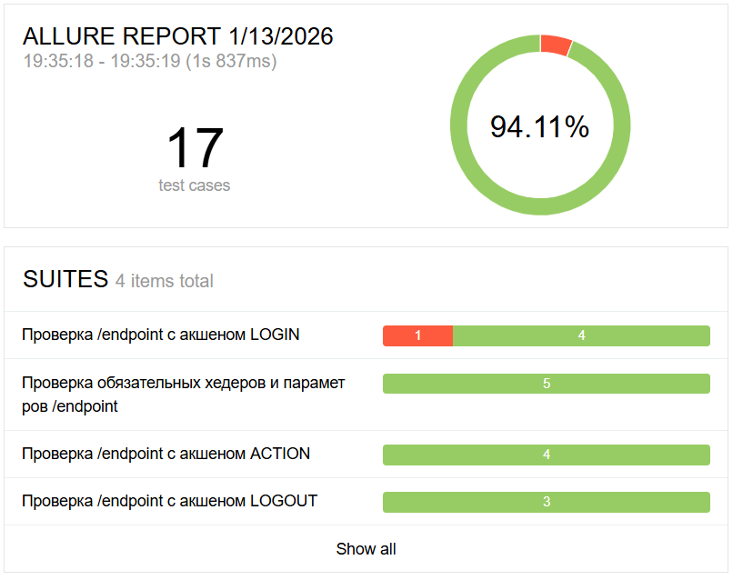
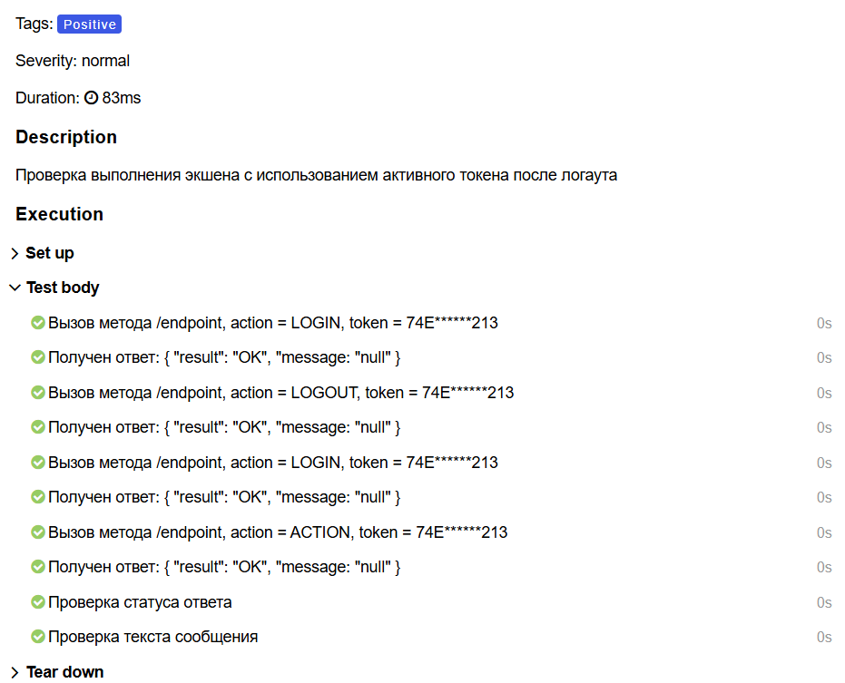
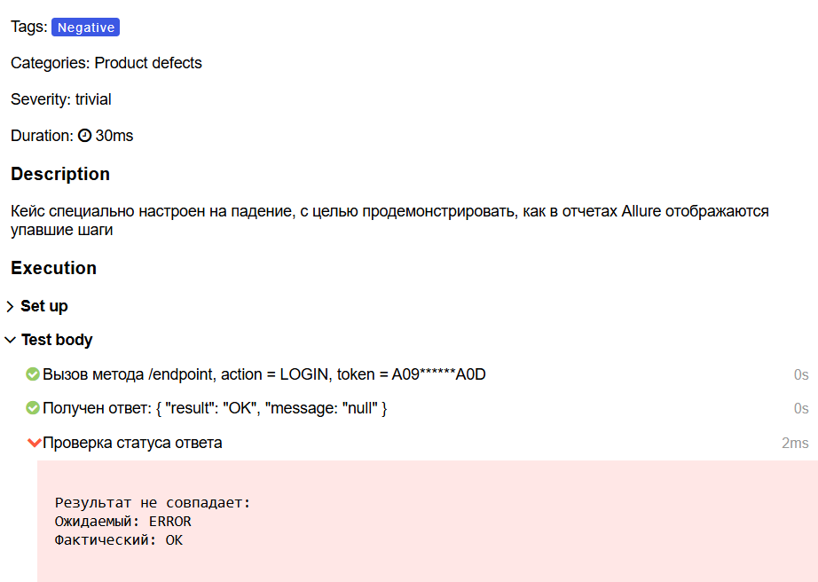

# nord-codes-test
#### Перминов Александр

Для выполнения проекта было сделано:
1. Локально развернут сервер с приложением, предоставленным компанией;
2. Добавлены следующие либы: 
- rest-assured
- wireMock
- allure
- jUnit
3. Тесты и отчеты запускались локально;

### Кейсы разбиты по параметру action для эндпойнта /endpoint

### Написаны степы для читаемости кейсов

### Настроено отображение причины падения кейсов

